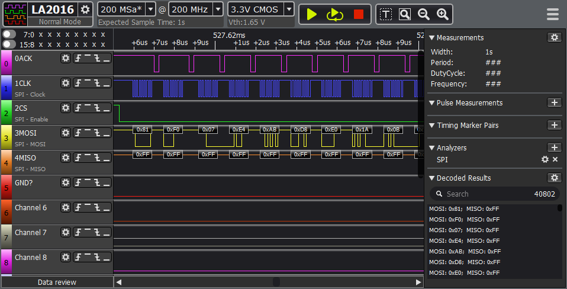
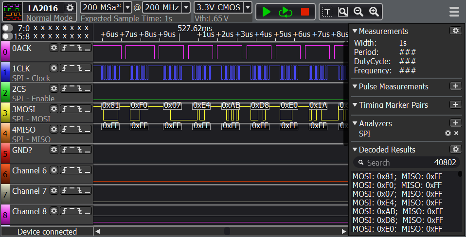
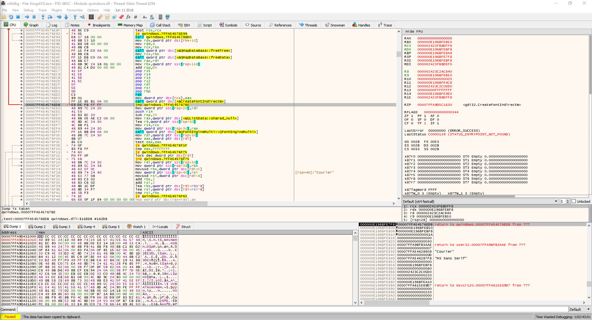

# KingstVis Font Size Patcher

## What
Patch to make 8's and B's more distinct in the KingstVis Logic Analyser

## How
Patches qwindows.dll's calls to CreateFontIndirectW

## But like...
I'm under no illusion that such a direct binary patch without wildcard searches will hold up, but between the source and the info below, it should be relatively easy to recreate it.

# Is it that bad?
Before: Is it an 8 or a B? God himsself could not help you here.

After: Awww yeah. Look at that. It's hideous. But legible.

## Steps:
- Start spooky bug (X64DBG) and open KingstVis.exe
- At the first sys breakpoint open the Symbols page, select `gdi32.dll` on the left and breakpoint on `CreateFontIndirectW` on the right (F2)
- Let it run.
- The first few return addresses to qwindows.dll from the BP will be the same. Ignore those until it changes.
  ( in my case the first 4 BPs return to an address ending in A2, then switch to BE on 5 )
- Follow this one, we'll code cave it
- RAX/EAX is pretty much always 0 so we'll cram that value into the font struct via code cave
  ( https://docs.microsoft.com/en-us/windows/win32/api/wingdi/ns-wingdi-logfonta )
- @ Drop a JMP instr over `call qword ptr ds:[<&CreateFontIndirectw>]` to the int3s at the end of the function
- RCX has the logfont struct so `mov dword ptr ds:[rcx], eax` gives us a 4 byte write instruction in 2 bytes 
- Pop in `call qword ptr ds:[<&CreateFontIndirectw>]`
- And jump back `jmp 0x00007FFA545767BE` or something similar (E9 DE F8 FF FF)

